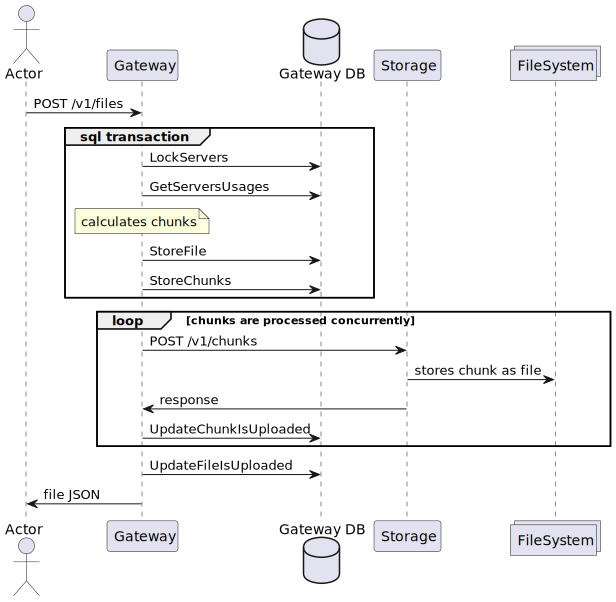
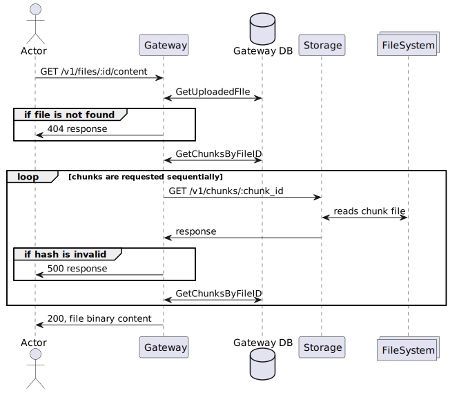
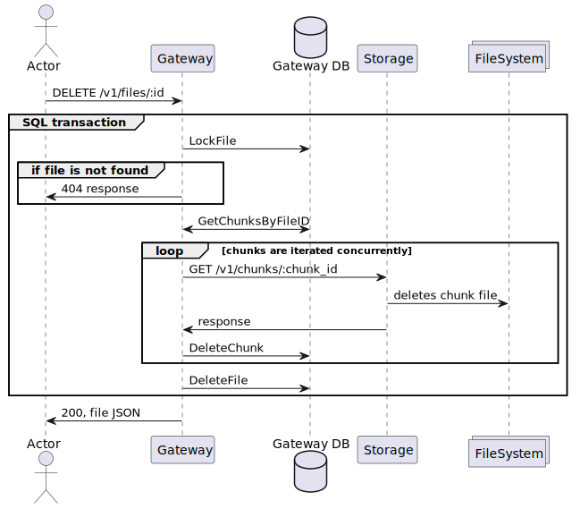
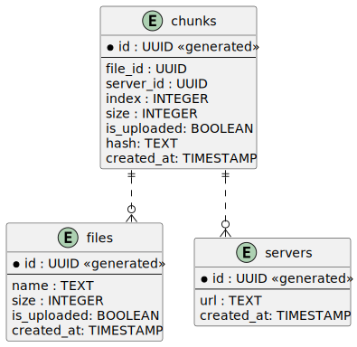

# File storage
## Usage
```bash
# start postgres in docker and waits for it to be healthy
# starts components and performs integration tests
make int-test

# runs unit tests with -race
make unit-test

# starts postgres in docker (5433 port) and waits for it to be healthy
# runs gateway component using config file from ./local
make run-gateway

# runs storage component using config file from ./local
make run-storage 
```

## High level architecture
### Gateway
- Provides REST API by requirements
- Uses Postgres DB

### Gateway DB
- Postgres DB
- Stores servers, files, chunks

### Storage
- Provides REST API for simplicity
- Used as a file content storage by Gateway

### Use Cases
1. User uploads a file.

   
2. User downloads a file content.

   
3. User deletes file.

   

### Gateway DB Entities Relations
